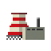

<h1 align="center">
 Nukleon
</h1>

<strong>A 2D automation game about operating a nuclear powerplant <em>in an <a href="https://en.wikipedia.org/wiki/Nineteen_Eighty-Four">Orwellian future</a>.</em></strong>
 
Created using <a href="https://flutter/">Flutter</a>.

 

**Looking for testers and supporters! Join the Discord [here](https://discord.gg/PbJQRT9zQ8)**

Work In Progress..

## Motivation

Just wanted to experiment with learning Flutter.

## API

This is not for public usage nor is it finalized, but it is here for managing public XML Schemas: https://exoad.github.io/nukleon/api

## Synoposis

This section describes the general parts that power the game. For the most part, you can find them under `lib/engine`; however, some parts are not directly written in Dart and are located in `modules/`.

### Graphics Layer (GL)

> Since Nukleon for the most part features many static assets and is not your traditional game featuring thousands of moving objects on screen, **Flutter was chosen** as compared to a previous consult with using `LibGDX` and `MonoGame`.
>
> **Why not the flame game engine?**
>
> Flame is a game engine built on top of Flutter, but it is highly generalized and it just seemed very limiting with the declarative nature it imposes to fit with Flutter's own declarative style. Using a declarative nature for not just the
> UI and complementing it with an already complex GLL (see below) would make the game very hard to develop, so a custom imperative nature is required.

Under the hood, all operations go to Flutter via the `Canvas` API directly. This gives way to maximizing performance when drawing sprites from Sprite atlases with the builtin spriting library: `sprite2d`. This allows for the creation of not just regular
2D sprites, but also efficiently drawing Nine-Slicing for custom elements. However, to easily integrate with the Flutter environment, all of these can then be rewrapped around regular Flutter widgets and placed in the base app. *This means that the graphics layer
powering Nukleon can easily be separated and reused in a regular app.*

Furthermore, since Flutter is a UI library it does not a constant render loop, meaning the window only refreshes when and where it needs to, not at some 60, 240 FPS. This works perfectly fine with the style of the game; however, for future functionalities, this might 

### Game Logic Layer (GLL)

Nukleon requires a fast game loop but at the same time cause absolutely zero lag to the single threaded nature of Flutter's UI building, thus the engine kit also bundles `hermes` which is a generalized way for processing fast amounts of data at once: aggregating. 
Hermes was specifically defined for processing large grid style data, not just in traditional multi-dimensional arrays, but also on ones implemented using quadtrees and linked lists. The hermes aggregator uses multiple `Isolates` (AKA threads; currently there are no plans
for supporting web) to pass data around; however, due to the nature of how Isolates work in Dart, there are significant overheads:

1. Passing a large multi-layer grid data structure is very, very, very, *very*, expensive (as essentially Dart will create a copy and then pass it to the isolate)
2. Must rely on message sending between the main isolate and the spawned isolates. This can be very tedious and can cause complications with complex code due to the sheer verbosity required.
3. Complex architecture when having to deal with multiple isolates and managing them and can be bug prone as well as ill-performing.

#### Processing the Reactor grid

The reactor grid is the core game play piece element in the game. It can contain from a $1$ x $1$ tile to an $n$ x $n$ which lets say we have a $22$ x $52$ equates to $1144$ tiles to process. 

However, the visual layer that you see on screen is not just one layer, it spans 5 layers, which you can think of as a layered 2D grid. Each of these layers contain different information on the state of the reactor such as the heat of a cell, what kind of cell a tile is holding, etc.. However,
when processing them, if lets say we just have $2$ layer, we will have $1144*5=5720$, which is a darn lot to process.

With the previous afforementioned overheads of isolates in Dart, a lot of the game and engine revolves around the concepts of `registries` (which are just lookup tables) and just straightup magic numbers (basically everything in the grids). The reactor grid only consists of numbers, never any other type of objects and each layer has a specific `Class` which is linked to registry you should lookup. When the engine wants to draw a specific cell, it would lookup `Class::CELLS` in the texture registry and get the result, which would be a `sprite2d` instance. Additionally, this grid is never passed around due to the fact that this will cause a copy to spawn (and thus more memory), instead only coordinates are passed in literally a tuple format: `<row, column, class, before?, after?>`. Here, any parameters with `?` represents that this value is only present when an isolate broadcasts, but is not present when it is requesting the property of a certain cell.

**But, wouldn't it be nicer to just have a grid of objects that can be serialized into JSON Encoded strings and back?**

Sure it would be nicer to work with, but the process of encoding and decoding the string each time and then passing it back imposes significant latency as well introducing additional values which are the strings. Mind the fact that since strings are immutable, these two string instances:
`"123456"` and `"1234567"` will be new instances, even though they just share diff, they will be new instances in the string pool.

---

Copyright (C) 2025 Jiaming Meng. All rights reserved. **This is a source available software as of now. Please do not mistake it for free and open-source.**

For inquiries regarding the use of this project, please contact [reachout@exoad.net](mailto://reachout@exoad.net).
